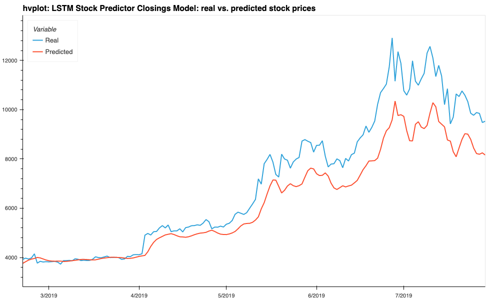

# LSTM Stock Predictor

Due to the volatility of cryptocurrency speculation, investors will often try to incorporate sentiment from social media and news articles to help guide their trading strategies. One such indicator is the [Crypto Fear and Greed Index (FNG)](https://alternative.me/crypto/fear-and-greed-index/) which attempts to use a variety of data sources to produce a daily FNG value for cryptocurrency. You have been asked to help build and evaluate deep learning models using both the FNG values and simple closing prices to determine if the FNG indicator provides a better signal for cryptocurrencies than the normal closing price data.

### Evaluate the performance of each model

Finally, use the testing data to evaluate each model and compare the performance.

## Which model has a lower loss?
- - -
In each case: model training (cell# 21, epochs: 100, batch sie: 10), model performance evaluation: cell# 24, model predicted v. real values: cell# 27 the Closings model rendered lower losses.  
 
Closings predictor cell 21, window 10  
    
Closings predictor cell 24, window 10  
    
Closings predictor cell 27, window 10  
    

## Which model tracks the actual values better over time?
- - -
While both, FNG and Closings predictor, degrade as window extends the Closings more accuratedly tracked actual values.  
 
FNG predictor cell 21, window 10  
    
FNG predictor cell 24, window 10  
    
FNG predictor cell 27, window 10  
    

## Which window size works best for the model?  
- - -
To contrast the results windows of 10 and 100 were used. A long window made the Closings predictor more accurate holding remarkably to the actual values. While the FNG model malfunctioned rendering a flatline at 6000$.  
 
Closings predictor plot, window 10  
    
FNG predictor plot, window 10  
    
Closings predictor plot, window 100  
    
FNG predictor plot, window 100  
    
- - -

© 2019 Trilogy Education Services, a 2U, Inc. brand. All Rights Reserved.
